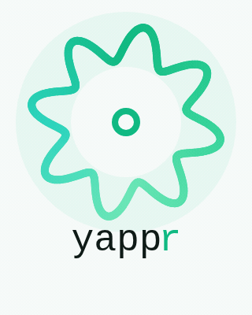

<p align="center">
  
</p>

# 🎙️ yappr

> **Local, private, low-latency voice dictation for macOS.** Hold a hotkey, talk, release — cleaned-up text streams onto your screen at the cursor. Everything runs on-device on Apple Silicon. No network, no clipboard, no cloud.


> 📺 Screen recording placeholder — drop a gif here once you have one.

---

## ✨ How it works (60 seconds)

You hold **Ctrl+Option+Y**, talk, and release. Under the hood:

1. 🎙️ A **long-running Swift daemon** (`YapprSttDaemon`) owns the mic via `AVAudioEngine` and runs **streaming Nemotron 0.6B** (FluidAudio) in-process. Press = socket connect = mic on; release = half-close = mic off + finalize. Hotkey-to-first-sample is fast because the model is preloaded and the engine is warmed.
2. 🧠 **Qwen3-1.7B-4bit via MLX** cleans up the verbatim transcript (removes "um", fixes grammar, adds punctuation)
3. ⚡ Each token is **typed at your cursor as it streams** from the LLM
4. 🎯 The LLM cleanup runs on a **custom MLX server with explicit prefix caching** we built because stock `mlx_lm.server` doesn't cache prefixes across independent API calls — measured **~32% TTFT reduction** on a ~340-token cleanup prompt

Full architecture → [`docs/architecture.md`](docs/architecture.md). Performance numbers → [`docs/performance.md`](docs/performance.md).

---

## 🗣️ Voice commands

This is the part that makes yappr feel like *dictation*, not just transcription. Speak these phrases naturally and the cleanup model interprets them inline — the command words are removed from the output.

| Say                                              | Effect                                                |
|--------------------------------------------------|-------------------------------------------------------|
| 🚫 "scratch that" / "delete that" / "ignore that" | Remove the previous sentence                          |
| 📄 "new paragraph"                                | Insert a paragraph break                              |
| ↩️ "new line"                                     | Insert a single line break                            |
| 🔘 "make this a list" / "bullet list"             | Reformat preceding items as a markdown bullet list    |
| 🔠 "all caps X"                                   | Uppercase X (e.g. "all caps qa" → "QA")               |
| ✏️ "period" / "comma" / "question mark" / "colon" | Insert that punctuation when clearly a directive      |

### Live examples

> 🎤 *"buy milk new line buy eggs new line buy bread make this a list"*
>
> ```
> - Buy milk
> - Buy eggs
> - Buy bread
> ```

> 🎤 *"the migration is tomorrow scratch that the migration is on Friday"*
>
> ```
> The migration is on Friday.
> ```

> 🎤 *"send the file to all caps qa for review"*
>
> ```
> Send the file to QA for review.
> ```

> 🎤 *"um so like I wanted to mention the deployment is tomorrow you know"*
>
> ```
> I wanted to mention the deployment is tomorrow.
> ```

🛡️ Questions and commands in your speech are **rewritten, not answered** — the prompt is tightly framed as a transcript cleaner, not a chatbot. Saying "what time is the meeting" yields *"What time is the meeting?"*, not an answer.

---

## 🚀 Quick install

macOS on Apple Silicon (M1/M2/M3/M4). Three lines:

```bash
git clone https://github.com/matteociccozzi/yappr.git ~/toolkit/yappr
cd ~/toolkit/yappr
./scripts/install.sh
```

The script is idempotent and handles dependencies, the Swift build, codesigning, and PATH setup. Three permissions it **can't** grant for you (macOS will prompt):

- 🎙️ Microphone access for the daemon (system dialog on first launch)
- ⌨️ Accessibility + Input Monitoring for Hammerspoon (push-to-talk)
- 🧠 LLM endpoint configuration (edit `configs/active.json`)

Full step-by-step walkthrough: [`docs/installation.md`](docs/installation.md).

---

## 📖 Documentation

| Doc                                                | What's inside                                                       |
|----------------------------------------------------|---------------------------------------------------------------------|
| 🛠️ [`docs/installation.md`](docs/installation.md)    | Step-by-step setup, deps, permissions, Hammerspoon config           |
| 🏗️ [`docs/architecture.md`](docs/architecture.md)    | Pipeline diagram, component breakdown, what each binary does        |
| ⚡ [`docs/performance.md`](docs/performance.md)      | Benchmark numbers + how prefix caching beats stock `mlx_lm.server` |
| ⚙️ [`docs/configuration.md`](docs/configuration.md)  | Versioned configs, `yappr-config` CLI                               |
| 📊 [`docs/metrics.md`](docs/metrics.md)              | Per-run JSONL, `yappr-stats` summarizer & A/B comparisons           |
| 🎨 [`docs/customization.md`](docs/customization.md)  | Cleanup prompt, custom vocab, hotkey choice, model swap             |
| 🔬 [`docs/diagnostics.md`](docs/diagnostics.md)      | Troubleshooting + the cache probe (dev tool)                        |

---

## 🤔 Why does this exist?

I wanted push-to-talk dictation that runs entirely on my laptop — no cloud round-trip, no audio leaving the machine, and full freedom to swap models, prompts, and hotkeys. yappr is that: local, private, low-latency, hackable.

---

## 🚧 Roadmap / known limitations

- 🇬🇧 **English only** (Nemotron 0.6B streaming). Multilingual would mean swapping the model in the daemon.
- ⛔ **No speculative decoding yet** — there's an [open bug in mlx-lm with the Qwen3 family](https://github.com/ml-explore/mlx-lm/issues/846); revisit later.
- 👤 **Single-tenant inference server** — one lock, one shared cache. Not a load-balanced production thing.
- 🧩 **Full-attention models only** — SSM/Mamba/hybrid won't work with the cache primitive.
- 🧪 **No tests.** Personal tool. Caveat emptor.

---

## 🙏 Credits

[MLX](https://github.com/ml-explore/mlx) / [mlx-lm](https://github.com/ml-explore/mlx-lm), [FluidAudio](https://github.com/FluidInference/FluidAudio) (streaming Nemotron 0.6B), [Qwen3](https://qwenlm.github.io/), [Hammerspoon](https://www.hammerspoon.org/).

---

Made by [@matteociccozzi](https://github.com/matteociccozzi) · [MIT License](LICENSE) · PRs and issues welcome.
